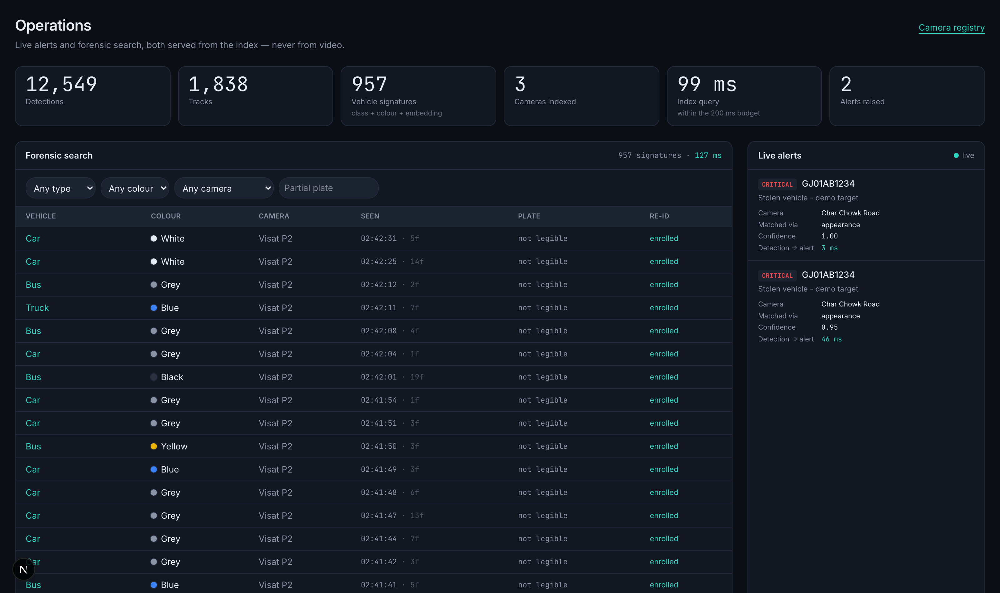
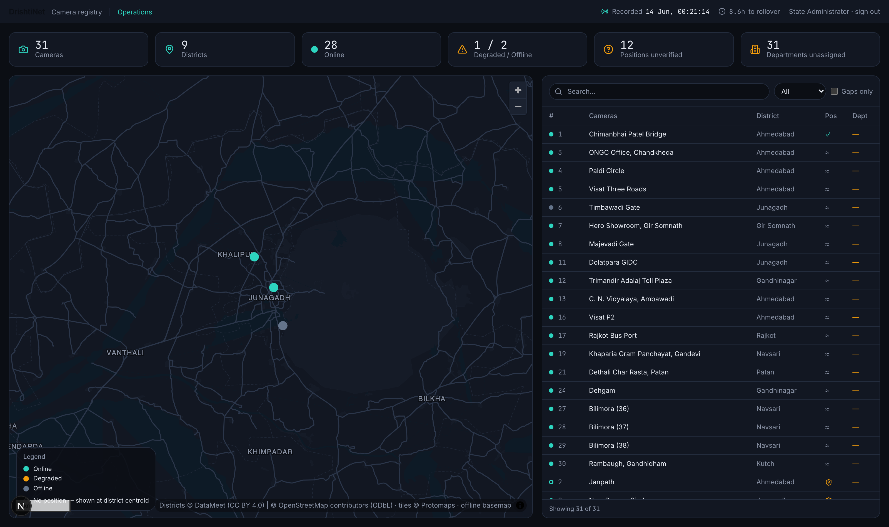
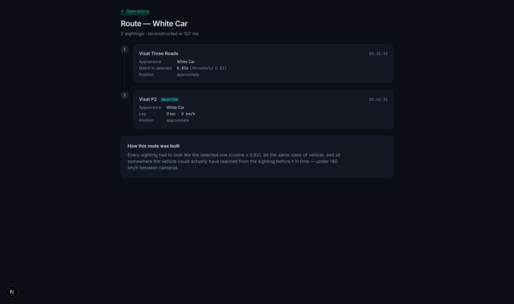
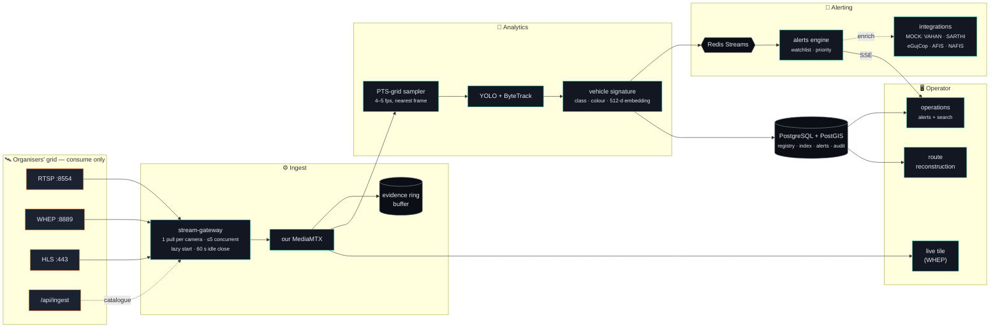
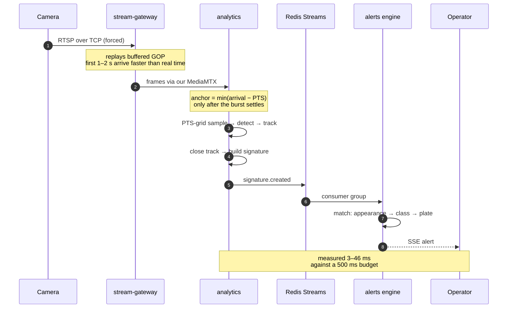
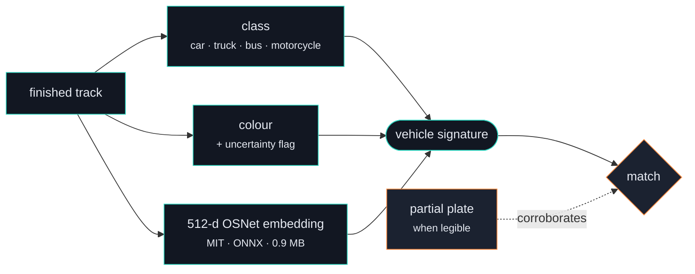
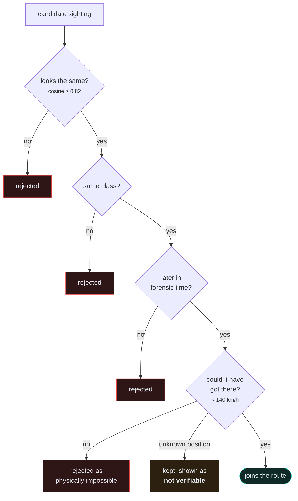
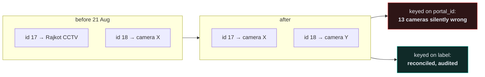

<div align="center">

# DrishtiNet

### A centralised CCTV registry and GIS, with vehicle analytics that respects what the cameras can actually see

**Gujarat Police Innovation Challenge 2026 — "Sentinel"**
SCRB Gujarat Police · i-Hub Gujarat · Student category
Reference Model 1 *(mandatory)* + a deep slice of Model 4

<br>


</div>

---

## The operations screen

Live alerts beside forensic search — both served from the index, never from video.



<table>
<tr>
<td width="50%">

**Camera registry + GIS**
31 cameras, 9 districts, self-hosted offline basemap, audited drag-to-place positioning.



</td>
<td width="50%">

**Cross-camera route reconstruction**
Constrained by geography, not just resemblance. Unverifiable legs say so.



</td>
</tr>
</table>

---

## Measured, not claimed

Every figure below was produced by this build. Nothing here is aspirational.

<div align="center">

| Property | Budget | Measured | |
|---|---:|---:|:--|
| Detection → alert on screen | 500 ms | **3–46 ms** | 🟢 |
| Forensic search over the index | 200 ms | **36–141 ms** | 🟢 |
| Cross-camera route reconstruction | — | **139–373 ms** | 🟢 |
| Analytics throughput, one camera | 5 fps | **25 sampled fps** | 🟢 |
| Re-ID separation *(same vs different vehicle)* | — | **0.950 vs 0.544** | 🟢 |

**12,549** detections · **1,838** tracks · **957** vehicle signatures · **3** cameras indexed

</div>

---

## Architecture



> **Why a gateway sits in front of everything.** The organisers give each client its own copy of a
> stream. Letting every browser tile and analytics worker open its own upstream connection would
> multiply load on shared infrastructure by the number of viewers. One pull per camera feeds our own
> MediaMTX; everything downstream reads from us. The five-camera ceiling is a politeness limit, not
> a performance one.

---

## From frame to alert



---

## The measurement that shaped everything

<div align="center">

### ⚠️ ANPR does not work on this grid — and that is demonstrable

</div>

> Measured in **daylight**, at the organisers' own camera geometry: the median vehicle box is
> **164 px wide**, which puts a ten-character number plate at roughly **41 px**. Reliable OCR needs
> nearer **90 px**.
>
> ### **Zero of 27 sampled vehicles cleared that bar.**

The limit is **camera distance and sensor resolution — not lighting**. No model choice fixes it.

So no OCR engine is installed. A recogniser run on a 41 px plate does not fail cleanly: it returns a
*confident wrong registration number*, and a wrong registration in a police alert is worse than no
alert at all.

**What identifies a vehicle instead:**



| | Median cosine similarity |
|---|---:|
| Same vehicle, different frames | **0.950** |
| Different vehicles | **0.544** |

---

## Routes respect geography, not just resemblance

At a cosine threshold of 0.82, the appearance model found:

<div align="center">

| Camera pair | Separation | Matches | Verdict |
|---|---:|---:|:--|
| **5 ↔ 16** — one junction, two angles | ~0 km | **949** | ✅ the system working |
| **5 ↔ 10** — different districts | **~300 km** | **20** | ❌ two white cars that look alike |

</div>

An appearance model cannot tell those apart, because nobody asked it about geography. A route
therefore requires **four** things:



> Legs touching a camera with no placed position are **kept but flagged**. A mapping gap is not
> evidence of absence — and *"not disproved"* must never render as *"confirmed"*.

---

## Honesty as a design constraint

The system states its own uncertainty rather than rounding it away.

| Signal | Behaviour | Verified |
|---|---|---|
| **Colour uncertain** | shown when light is too poor to trust the hue | 0/138 flagged in daylight, **13/146 at night** |
| **"Not legible"** | where a plate could not be read — never a guess | 0 plates claimed across 957 signatures |
| **Repaired reading** | never renders identically to a clean one | surfaced in the alert |
| **MOCK** | on anything a mocked government system touched | body + HTTP header + OpenAPI |
| **Auto clock-anchor** | built, **measured at 35.4 % against a 95 % gate, disabled** | camera 16 has no clock at all |

> An operator who catches the system overstating once stops trusting it entirely.

---

## Surviving reality

On **21 August** the portal migrated from progressive MP4 to live RTSP, removed a camera, and
shifted every id above it down by one — silently repointing **13 ids at different physical cameras**.



Nothing downstream of the adapter contract changed when the protocol did. **This is the strongest
evidence the architecture is sound: it was tested by an unannounced change, not by us.**

---

## Repository layout

| Path | What it is |
|---|---|
| [`apps/web`](apps/web) | Next.js 15 — registry + GIS, operations screen, route reconstruction |
| [`services/stream-gateway`](services/stream-gateway) | One upstream pull per camera; the uniform adapter contract |
| [`services/analytics`](services/analytics) | Python — PTS-grid sampling, detection, tracking, signatures |
| [`services/alerts`](services/alerts) | Watchlist matching, priority, SSE fan-out, latency instrumented |
| [`services/integrations`](services/integrations) | Mock government systems, every response labelled |
| [`packages/db`](packages/db) | PostGIS schema, migrations, seed |
| [`docs/hld.md`](docs/hld.md) | High-Level Design |
| [`docs/deck.md`](docs/deck.md) | Solution presentation |
| [`docs/scale-and-operations.md`](docs/scale-and-operations.md) | Scaling, cost, DR, rollout |

---

## Running it

Everything runs offline on one machine — no internet, no cloud.

```bash
make setup           # dependencies into .venv/ and node_modules/, both in-repo
make infra           # postgres + postgis, redis, minio, mediamtx
make migrate         # additive migrations; never resets
make analytics-deps  # torch, ultralytics, model weights into ./models/
npm run dev          # web :3001 · gateway :4001 · alerts :4002 · integrations :4003
```

Sign in at `/login` as `admin`. The seed password is the value of `SEED_PASSWORD`, defaulting to a
development-only string in [`packages/db/src/seed.ts`](packages/db/src/seed.ts) — set your own and
re-seed for anything beyond local use.

Populate the operations screen from a development fixture:

```bash
make index-fixture ARGS='--fixture data/fixtures/cam_10_daylight.mp4 \
  --label "10 char-chowk-road-2-junagadh" --seconds 60'
```

<details>
<summary><b>Verification — five commands</b></summary>

<br>

```bash
make check           # 165 unit tests, all packages typechecked
make e2e             # 13 end-to-end tests in a real browser
make xcheck-timing   # proves the Python and TypeScript timing rules still agree
make conformance     # the organisers' §4 checklist, against our own self-test grid
make smoke           # starts every service, checks it answers, stops it again
```

`xcheck-timing` exists because the live-stream rules are implemented **twice** — TypeScript in the
gateway, Python in analytics — since the two processes timestamp the same frames and cannot share
code. Two copies of a rule drift, and a drift there would not crash anything: it would quietly place
one vehicle at two different times on two cameras, which is the one error cross-camera correlation
cannot survive.

</details>

---

## What this does not claim

> [!IMPORTANT]
> A submission that hides its edges invites the discovery of them.

- **No live-grid demonstration yet.** RTSP `:8554` and WHEP `:8889` do not answer from our network —
  they *hang* rather than refuse, the signature of a filtered port — and the documented HLS fallback
  returns `401` on its media playlist. `/api/ingest` answers `200`, so the grid is up and we reach
  it. All analytics results here were produced against **offline development fixtures**, and none is
  presented as live.
- **VAHAN, SARTHI, eGujCop, AFIS and NAFIS are local mocks.** No live government access is held or
  implied. AFIS and NAFIS expose no lookup at all — only a readiness statement.
- **No facial recognition is implemented.** Documented integration-readiness only.
- **The conformance suite has not run against the real grid**, because the grid has not been
  reachable. It runs green against our own MediaMTX self-test loop.

---

## Data handling

Footage is government property. It is never committed, uploaded or shared.

- Pre-migration captures under `data/fixtures/` are **offline development fixtures only** — unit
  tests, re-identification labelling, CI — and are deleted after the event.
- The **evidence ring buffer** is the only government footage written to disk: we record what we are
  already receiving, and never fetch files.
- `make clean-data` removes both. Secrets live only in `.env`, which is gitignored and has never
  been committed.

---

## Compliance

DPDP Act 2023 (+ Rules, 13 Nov 2025) · CERT-In 2022 directions · ISO 27001 · OWASP ASVS ·
GIGW 3.0 + WCAG 2.1 AA · data residency in India

RBAC across five roles; placement restricted and audited. Evidence clips carry SHA-256 over the
bytes plus an immutable chain of custody, stream-copy only — re-encoding would make the hash a
statement about our transcoder rather than about what the camera sent.

---

## Licence

Open source throughout, as the challenge requires.
Model weights: **YOLOv8n** (Ultralytics, AGPL-3.0) · **OSNet x0.25** (MIT).
Basemap: **OpenStreetMap** contributors (ODbL) via Protomaps · district boundaries from
**DataMeet** (CC BY 4.0).
